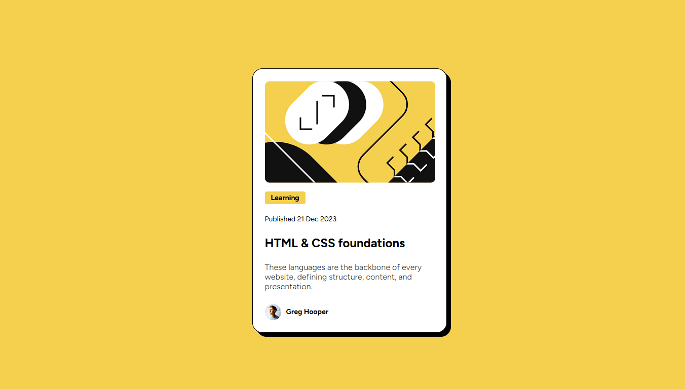

# Frontend Mentor - Blog preview card solution

This is a solution to the [Blog preview card challenge on Frontend Mentor](https://www.frontendmentor.io/challenges/blog-preview-card-ckPaj01IcS).
## Table of contents

- [Overview](#overview)
  - [The challenge](#the-challenge)
  - [Screenshot](#screenshot)
  - [Links](#links)
- [My process](#my-process)
  - [Built with](#built-with)
  - [What I learned](#what-i-learned)
  - [Continued development](#continued-development)
  - [Useful resources](#useful-resources)
- [Author](#author)

## Overview

### The challenge

Users should be able to:

De ver um Cartão de pré-visualização de blog. 
Neste desafio somente com HTML e CSS é um projeto perfeito para iniciantes que querem se familiarizar com os fundamentos de HTML e CSS, como a estrutura HTML e o modelo de caixa(Flexbox).

### Screenshot

### Links

- Solution URL: (https://your-solution-url.com)

## My process

### Built with

- Semantic HTML5 markup
- CSS custom properties
- Flexbox
- CSS Grid - Autofill
- Media Querye

### What I learned

- Estamos aprendendo CSS, nesse projeto comecei utilizando apenas display flex para organizar o visual da página, porém depois tentei utilizar display GRID, já que foi um dos últimos assuntos estudados de CSS do curso de frontend que estou fazendo. Tivemos um pouco de dificuldade, mas nada que com mais estudo ou prática não podemos melhorar. 

### Continued development

Desejo continuar melhorar na questão de espaçamentos do CSS, melhorar e estudar mais sobre display flex e display Grid.
Continuar e melhorar na questão de responsividade, deixando os projetos com maior compatibilidade em diversos instrumentos de acesso.

### Useful resources

None

## Author

- Website - [Andre Dantas](https://github.com/andredantasti)
- Frontend Mentor - [@andredantasti](https://www.frontendmentor.io/profile/andredantasti)
- Instagram - [@andredantasti](https://www.instagram.com/andredantasti)